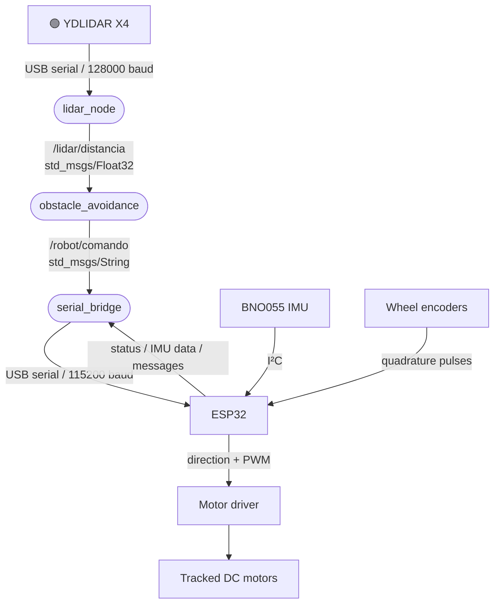
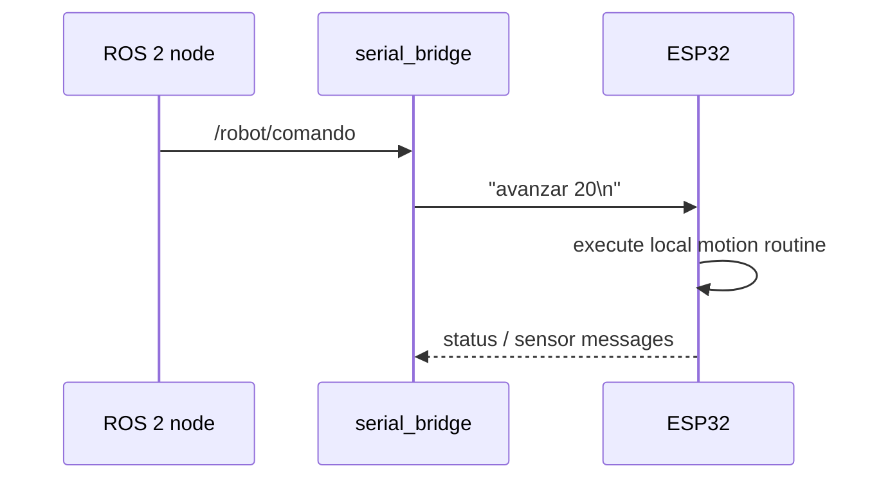
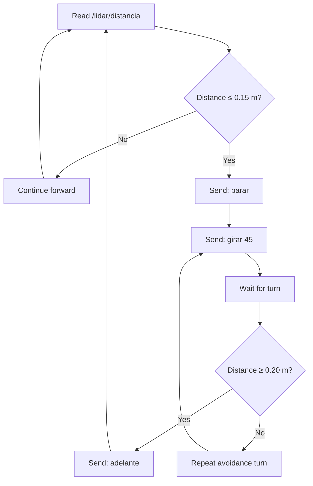

<div align="center">

# 🤖 EduBot-ROS2

### Educational tracked robot with ROS 2, Raspberry Pi 5, ESP32, YDLIDAR X4 and BNO055


**Status:** hardware integration and first ROS 2 nodes have been experimentally tested.  
**Source-code upload:** pending; the project source files will be added progressively.

</div>

---

## 📌 Overview

**EduBot-ROS2** is an educational tracked mobile robot designed as a hands-on platform for learning:

- embedded programming with ESP32;
- ROS 2 node development;
- serial communication between ROS 2 and a microcontroller;
- 2D LiDAR acquisition;
- inertial sensing with a BNO055 IMU;
- encoder-based motion estimation;
- basic reactive obstacle avoidance;
- progressive integration of perception, decision-making and actuation.

The current platform uses a **Raspberry Pi 5 running Ubuntu 24.04 and ROS 2 Jazzy** for high-level tasks, while an **ESP32** handles the low-level motor interface, encoder acquisition and BNO055 reading.

The project is related to the architecture explored in the research article:

> H. B. Guerrero, D. C. Montenegro and A. L. Jutinico,  
> **“Reactive fuzzy control and field validation of a low-cost autonomous tracked robot for plantain crop row following,”**  
> *Engineering Research Express*, vol. 8, 045227, 2026.  
> DOI: https://doi.org/10.1088/2631-8695/ae458e

The educational platform intentionally starts from simpler ROS 2 interfaces and behaviors before moving toward the more complete perception-and-control architecture described in that work.

---

# 🧠 System architecture



The current ROS 2 implementation is deliberately modular:

| Component | Role |
|---|---|
| `serial_bridge` | Bidirectional communication between ROS 2 and the ESP32 |
| `lidar_node` | Reads the YDLIDAR X4 and publishes a processed distance |
| `obstacle_avoidance` | Makes a simple reactive decision based on LiDAR distance |
| ESP32 firmware | Motor actuation, encoder reading, BNO055 acquisition and local motion routines |

---

# ✅ Current verified functionality

The following functions have already been tested on the physical robot:

- [x] ESP32 firmware running with PlatformIO.
- [x] Both tracked motors operating in the correct direction.
- [x] Quadrature encoders connected and read by the ESP32.
- [x] BNO055 detected and read through I²C.
- [x] ROS 2 Jazzy running on Raspberry Pi 5.
- [x] ROS 2 ↔ ESP32 communication through `serial_bridge`.
- [x] High-level text commands sent from ROS 2 to the ESP32.
- [x] YDLIDAR X4 working through the YDLidar SDK.
- [x] LiDAR measurement from a ROS 2 node.
- [x] `/lidar/distancia` topic.
- [x] First reactive obstacle-avoidance node.
- [x] Obstacle threshold configured at **15 cm**.
- [x] Safety hysteresis configured at **20 cm**.
- [x] Corrective turn command of **45°**.

---

# 🔩 Hardware

## Main components

| Device | Function |
|---|---|
| Raspberry Pi 5 | ROS 2 high-level processing |
| ESP32 | Embedded motor/sensor controller |
| YDLIDAR X4 | 2D environment ranging |
| BNO055 | Yaw and angular-rate sensing |
| 2 × DC gear motors | Differential tracked locomotion |
| 2 × quadrature encoders | Wheel/motor motion feedback |
| Motor driver | Power stage for both motors |
| Tracked chassis | Mobile platform |

---

# 🔌 ESP32 pin assignment

The current tested pin assignment is:

| Function | ESP32 GPIO |
|---|---:|
| Motor A enable / PWM (`ENA`) | 25 |
| Motor A direction (`IN1`) | 27 |
| Motor A direction (`IN2`) | 26 |
| Motor B enable / PWM (`ENB`) | 14 |
| Motor B direction (`IN3`) | 13 |
| Motor B direction (`IN4`) | 18 |
| Left encoder A | 34 |
| Left encoder B | 35 |
| Right encoder A | 32 |
| Right encoder B | 33 |
| BNO055 SDA | 21 |
| BNO055 SCL | 22 |

> ⚠️ **Important:** GPIO12 was initially used for one motor-driver direction input.  
> This caused ESP32 boot problems (`invalid header: 0xffffffff`) because GPIO12 is a strapping-related pin on the ESP32.  
> The signal was moved to **GPIO18**.

The motor-direction definitions were also inverted in software so that the command `adelante` physically moves both tracks forward.

---

# 🖥️ Software environment

The current development environment is:

- Ubuntu 24.04
- ROS 2 Jazzy
- Python 3.12
- PlatformIO / Arduino framework for ESP32
- YDLidar SDK
- PySerial
- Git / GitHub CLI

---

# 📁 Planned repository structure

The source files will be uploaded progressively.

```text
EduBot-ROS2/
│
├── README.md
├── .gitignore
│
├── esp32/
│   └── firmware/
│
├── ros2_ws/
│   └── src/
│       ├── edubot_serial_bridge/
│       ├── edubot_lidar/
│       └── edubot_navigation/
│
├── docs/
│   ├── wiring/
│   ├── tests/
│   └── reports/
│
└── diagrams/
```

The ROS 2 generated directories should **not** be committed:

```text
build/
install/
log/
```

A suitable `.gitignore` is:

```gitignore
# ROS 2
build/
install/
log/

# Python
__pycache__/
*.pyc
*.pyo
*.pyd

# Editors
.vscode/
.idea/

# Temporary files
*.swp
*~
```

---

# 🛰️ USB devices on the Raspberry Pi

The ESP32 and the YDLIDAR interface may both appear as Silicon Labs CP2102 USB-to-UART devices.

Because both devices can expose very similar USB identification information, relying only on:

```bash
/dev/ttyUSB0
/dev/ttyUSB1
```

may be fragile.

For this robot, the devices were distinguished by their **physical USB path**:

```bash
ls -l /dev/serial/by-path/
```

> The exact `by-path` names depend on which physical Raspberry Pi USB connectors are used.  
> Keep each device connected to the same physical port when using fixed `by-path` configuration.

---

# 🧭 ROS 2 nodes

## 1. `serial_bridge`

### Purpose

`serial_bridge` provides communication between ROS 2 and the ESP32.

It subscribes to:

```text
/robot/comando
```

Message type:

```text
std_msgs/msg/String
```

Typical commands include:

```text
pose
bno_valores
adelante
parar
avanzar 20
girar 30
girar -30
```

### Data path



### Run

```bash
source /opt/ros/jazzy/setup.bash
source ~/edubot_ws/install/setup.bash

ros2 run edubot_serial_bridge serial_bridge
```

### Basic test

From another terminal:

```bash
source /opt/ros/jazzy/setup.bash
source ~/edubot_ws/install/setup.bash

ros2 topic pub --once \
/robot/comando \
std_msgs/msg/String \
"{data: 'pose'}"
```

Test the IMU:

```bash
ros2 topic pub --once \
/robot/comando \
std_msgs/msg/String \
"{data: 'bno_valores'}"
```

Test a short movement:

```bash
ros2 topic pub --once \
/robot/comando \
std_msgs/msg/String \
"{data: 'avanzar 20'}"
```

Stop:

```bash
ros2 topic pub --once \
/robot/comando \
std_msgs/msg/String \
"{data: 'parar'}"
```

---

# 📡 YDLIDAR X4

The X4 was experimentally validated with the following SDK configuration:

```python
laser.setlidaropt(ydlidar.LidarPropSerialBaudrate, 128000)
laser.setlidaropt(ydlidar.LidarPropLidarType, ydlidar.TYPE_TRIANGLE)
laser.setlidaropt(ydlidar.LidarPropDeviceType, ydlidar.YDLIDAR_TYPE_SERIAL)
laser.setlidaropt(ydlidar.LidarPropScanFrequency, 10.0)
laser.setlidaropt(ydlidar.LidarPropSampleRate, 9)
laser.setlidaropt(ydlidar.LidarPropSingleChannel, True)
```

These values correspond to the configuration that worked on the physical sensor used in this project.

---

# 🛠️ YDLidar SDK installation

Install the required packages:

```bash
sudo apt update

sudo apt install -y \
git \
cmake \
pkg-config \
swig \
build-essential \
python3-dev \
python3-pip
```

Clone the SDK:

```bash
cd ~
git clone https://github.com/YDLIDAR/YDLidar-SDK.git
```

Build it:

```bash
cd ~/YDLidar-SDK
mkdir -p build
cd build
cmake ..
make -j4
sudo make install
```

On the tested Raspberry Pi, the wrapper was installed under:

```text
/usr/local/lib/python3/dist-packages/
```

If Python does not find it, add this to `~/.bashrc`:

```bash
export PYTHONPATH=/usr/local/lib/python3/dist-packages:$PYTHONPATH
```

Reload:

```bash
source ~/.bashrc
```

Test:

```bash
python3 -c "import ydlidar; print('YDLIDAR Python OK')"
```

Expected result:

```text
YDLIDAR Python OK
```

> Do not use `sudo python3` for normal LiDAR scripts unless it is absolutely necessary.  
> `sudo` may not preserve the user's `PYTHONPATH`.

---

# 📏 `lidar_node`

The first educational LiDAR node publishes a processed distance:

```text
/lidar/distancia
```

Message type:

```text
std_msgs/msg/Float32
```

The current implementation uses a small angular sector around approximately **90°** and computes an averaged projected distance from valid LiDAR points.

This node intentionally does **not** publish a complete `LaserScan` yet. That will be introduced in a later stage.

### Run

```bash
source /opt/ros/jazzy/setup.bash
source ~/edubot_ws/install/setup.bash
ros2 run edubot_lidar lidar_node
```

### Inspect the topic

```bash
ros2 topic echo /lidar/distancia
```

---

# 🚧 Reactive obstacle avoidance — Version 1

The first obstacle-avoidance experiment uses a simple ROS 2 state machine.

Current parameters:

```text
Obstacle threshold : 0.15 m
Free-path threshold: 0.20 m
Avoidance turn     : 45°
```

The difference between **15 cm** and **20 cm** creates hysteresis and prevents rapid switching between `adelante` and `parar` near a single threshold.

## Decision logic



---

# 🧩 `obstacle_avoidance`

The node:

- subscribes to `/lidar/distancia`;
- publishes commands on `/robot/comando`;
- stops the robot when the measured distance is 15 cm or less;
- requests a 45° turn;
- checks the LiDAR again;
- resumes forward motion when at least 20 cm is available.

### Run

```bash
source /opt/ros/jazzy/setup.bash
source ~/edubot_ws/install/setup.bash
ros2 run edubot_navigation obstacle_avoidance
```

---

# ▶️ Running the complete current system

Three terminals are currently used.

## Terminal 1 — ESP32 bridge

```bash
source /opt/ros/jazzy/setup.bash
source ~/edubot_ws/install/setup.bash
ros2 run edubot_serial_bridge serial_bridge
```

## Terminal 2 — LiDAR

```bash
source /opt/ros/jazzy/setup.bash
source ~/edubot_ws/install/setup.bash
ros2 run edubot_lidar lidar_node
```

## Terminal 3 — obstacle avoidance

```bash
source /opt/ros/jazzy/setup.bash
source ~/edubot_ws/install/setup.bash
ros2 run edubot_navigation obstacle_avoidance
```

---

# 🧪 Recommended test procedure

## 1. ESP32-only test

Before starting ROS 2, the ESP32 can be tested directly:

```bash
python3 -m serial.tools.miniterm /dev/ttyUSB0 115200
```

Useful commands:

```text
help
pose
bno_valores
avanzar 20
girar 30
parar
```

Exit `miniterm` using:

```text
Ctrl+T
Q
```

The serial port must be free before starting `serial_bridge`.

## 2. ROS 2 communication test

Start `serial_bridge`, then publish:

```bash
ros2 topic pub --once \
/robot/comando \
std_msgs/msg/String \
"{data: 'pose'}"
```

The bridge should display:

```text
ROS2 -> ESP32: pose
ESP32 -> ...
```

## 3. ROS 2 LiDAR test

Run:

```bash
ros2 run edubot_lidar lidar_node
```

Then:

```bash
ros2 topic echo /lidar/distancia
```

Move an object in the measured sector and verify that the distance changes.

## 4. Obstacle-avoidance test

> ⚠️ **First test with the tracks lifted from the ground.**

Expected behavior:

```text
distance > 0.20 m
        ↓
     adelante

distance ≤ 0.15 m
        ↓
      parar
        ↓
    girar 45
        ↓
  measure again
```

Only after verifying the complete command chain should the robot be tested on the floor.

---

# 🛑 Emergency stop

Manual ROS 2 stop command:

```bash
ros2 topic pub --once \
/robot/comando \
std_msgs/msg/String \
"{data: 'parar'}"
```

> ⚠️ **Hardware safety remains mandatory.**  
> The present ESP32 firmware still contains blocking movement routines. During some maneuvers a new serial command may not be processed immediately. For early experiments, keep physical access to the motor-power switch or power supply.

---

# ⚠️ Known limitations

This repository currently represents an **educational first stage**, not a complete autonomous navigation stack.

Current limitations include:

1. The LiDAR ROS 2 node publishes one processed distance rather than a full 360° `sensor_msgs/LaserScan`.
2. Obstacle avoidance currently reacts to one measured sector.
3. The avoidance turn is fixed at 45°.
4. The current behavior does not yet compare free space on the left and right.
5. Some ESP32 motion functions are blocking.
6. ROS 2 commands are currently text strings.
7. The IMU is read by the ESP32 rather than exposed as a dedicated ROS 2 IMU topic.
8. No SLAM or global planner is used.
9. RViz integration is intentionally postponed.
10. Source files are still being organized for upload to this repository.

---

# 🗺️ Roadmap


---

# 🧯 Troubleshooting notes

## ESP32 shows `invalid header: 0xffffffff`

Check whether GPIO12 is connected to an external circuit.

In this project, moving the motor-driver signal from GPIO12 to GPIO18 solved the boot problem.

## Motors rotate backwards

Current tested mapping:

```text
Motor A: IN1=27, IN2=26
Motor B: IN3=13, IN4=18
```

## `ModuleNotFoundError: No module named 'ydlidar'`

Check:

```bash
echo $PYTHONPATH
```

It should include:

```text
/usr/local/lib/python3/dist-packages
```

## Serial port is busy

Before starting `serial_bridge`, close:

- PlatformIO Serial Monitor;
- `miniterm`;
- other serial tools.

## ESP32 and LiDAR appear with confusing `ttyUSB` numbers

Check:

```bash
ls -l /dev/serial/by-path/
```

Use the physical USB path when stable device assignment is required.

---

# 📚 Related research

**Henry B. Guerrero, Danna C. Montenegro and Andrés L. Jutinico**  
*Reactive fuzzy control and field validation of a low-cost autonomous tracked robot for plantain crop row following*  
**Engineering Research Express**, 8, 045227, 2026.  
DOI: https://doi.org/10.1088/2631-8695/ae458e

That work used a Raspberry Pi 5, ESP32, 2D LiDAR, BNO055 IMU and ROS 2 for reactive under-canopy navigation. EduBot-ROS2 reuses the general hardware/software philosophy while simplifying the interfaces for educational development.

---

# 👥 Educational use

This repository is intended to support progressive laboratory activities in:

- embedded systems;
- mobile robotics;
- sensors and instrumentation;
- Python programming;
- ROS 2 publishers and subscribers;
- serial communication;
- feedback control;
- reactive robotics;
- autonomous navigation.

The goal is to make each software layer observable and modifiable before increasing the system complexity.

---

# 📄 License

A repository license has not yet been selected.

---

<div align="center">

### 🚜 From embedded control to autonomous robotics, one ROS 2 node at a time.

</div>
